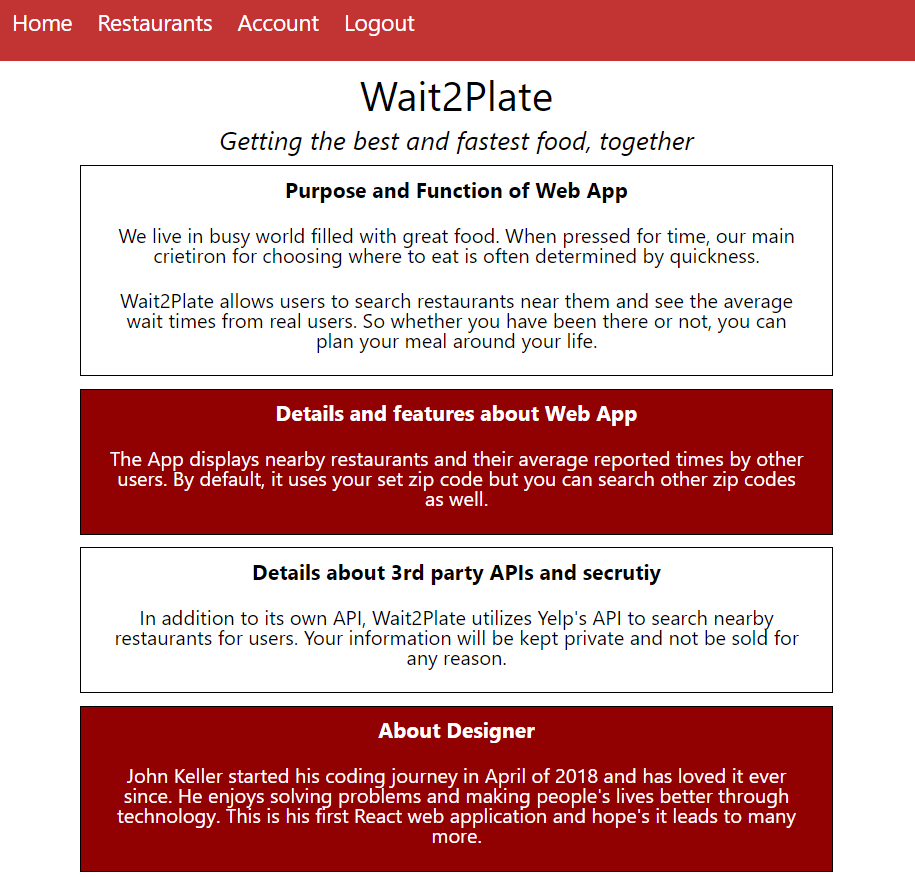
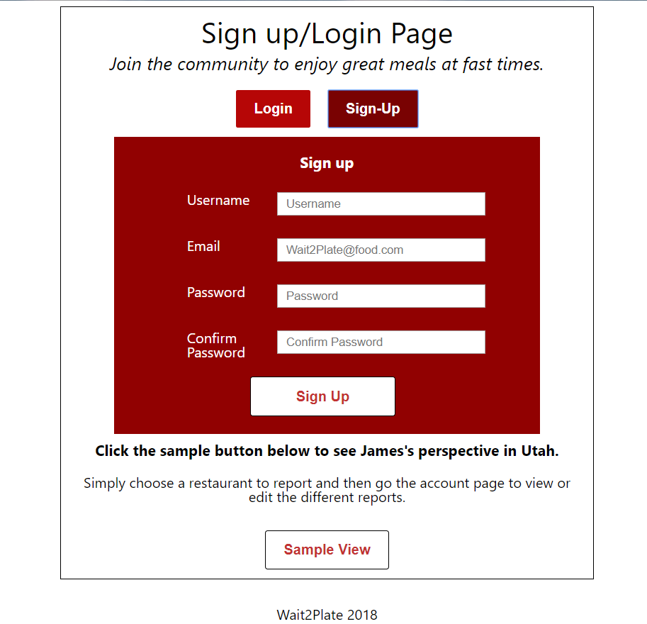
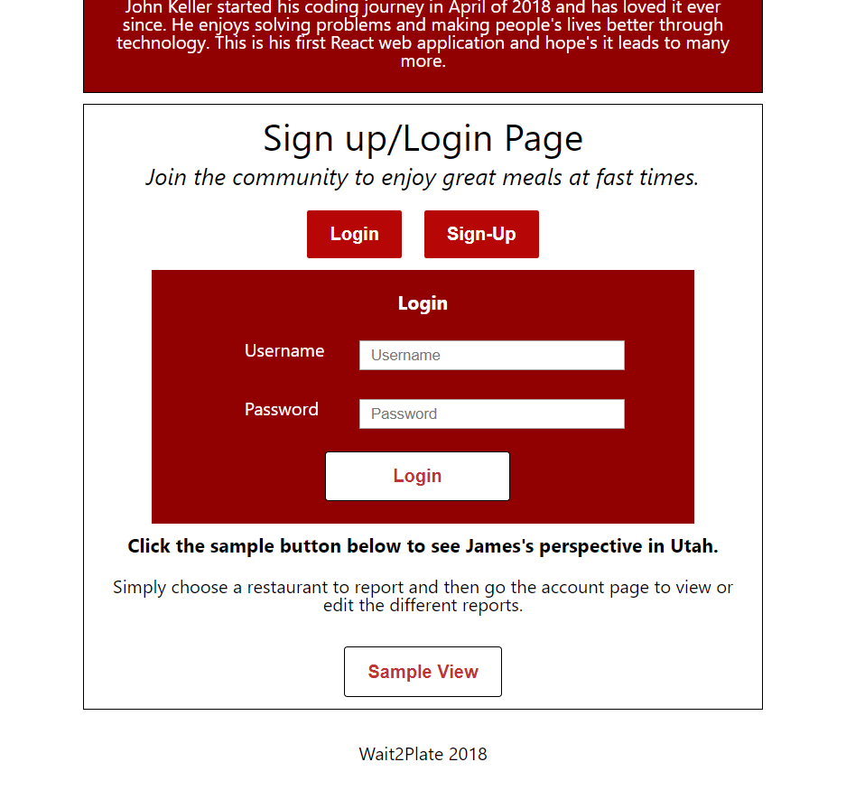
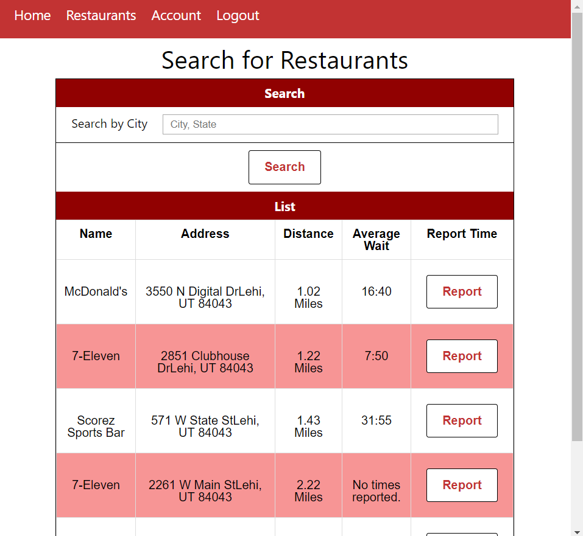
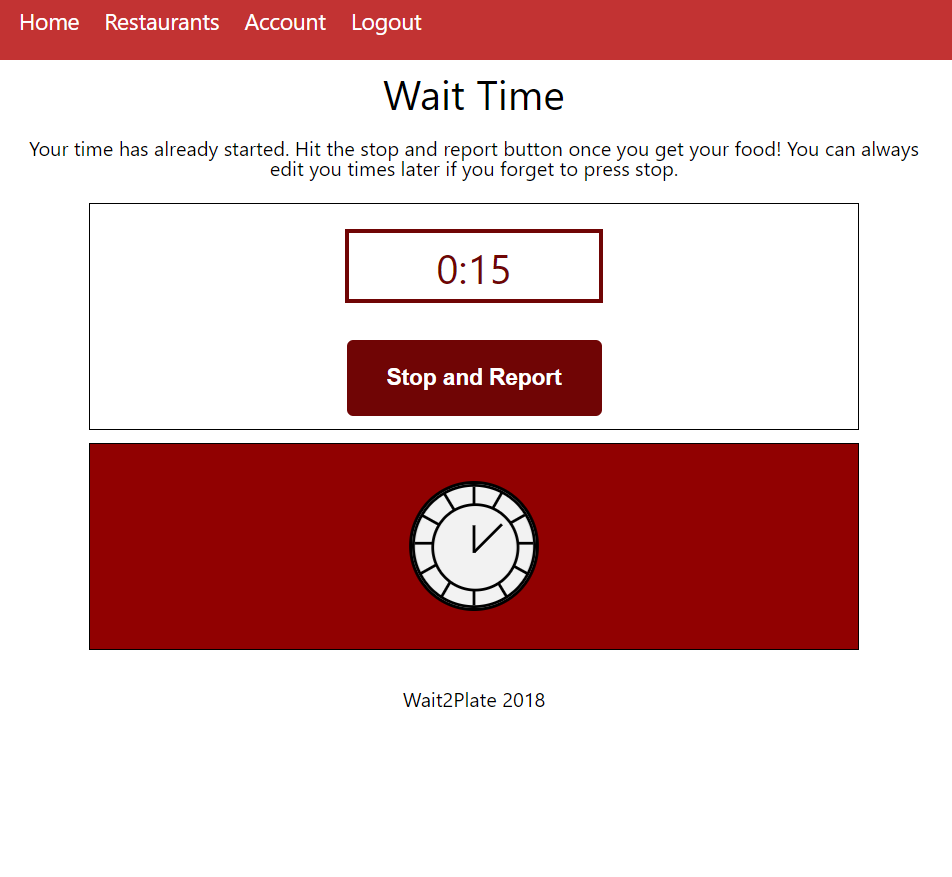
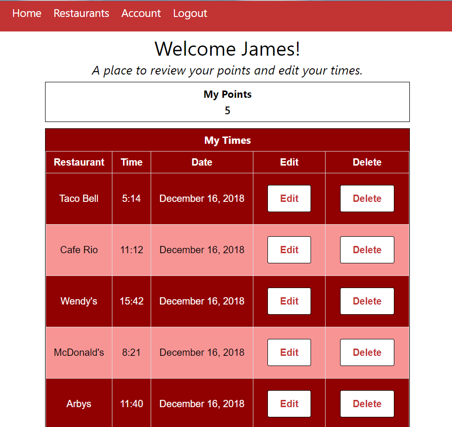

# Wait2Plate App

An application to search, find, and report the fastest food option near users. 

## Motivation
I recently moved across the country and had numberous new options for eating out. 
However, time is often an important factor in choosing a restaurant. This App offers users a 
means to search and report the wait times of restaurants near them. 

## Screenshots
Landing Page:

Restaurant Page:

Timer Page:

User's Account Page:

## Built With

* HTML
* CSS
* Javascript
* React
* Redux
* node.js
* Express
* Mongoose
* MongoDB

## Backend API

- [Github Link to Backend API](https://github.com/jmkeller3/wait2plate-server)

## Demo 

- [Live Demo](https://guarded-thicket-83395.herokuapp.com/)

## Author

* **John Keller** - ** Full-Stack development/Testing, Styling

## Acknowledgements

* **Nathaniel Webb** - ** - Advisor and Mentor
